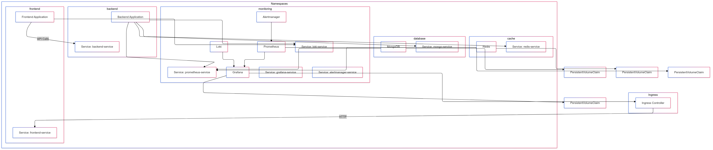

# Aplicación Multi-Entorno

## 1. Guía para hacer el setup del proyecto

### Requisitos previos

Antes de empezar, asegúrate de tener Node.js instalado para poder instalar las dependencias y ejecutar el proyecto.

Puedes descargar Node.js desde el sitio oficial: https://nodejs.org/es/

En caso de querer ver visualmente las bases de datos, puedes utilizar [MongoDB Compass](https://www.mongodb.com/try/download/compass) y conectarte poniendo `mongodb://0.0.0.0:27017` como URI. Una vez conectado, cuando levantes la aplicación, deberías ver la base de datos correspondiente.

### Instalación

1. Descarga el proyecto comprimido o clona el repositorio. Puedes descargarlo o clonarlo desde GitHub (https://github.com/billybala/multienv-app-kubernetes). Si prefieres clonar el repositorio, asegúrate de que estés en la carpeta donde quieres clonar el proyecto y ejecuta `git clone https://github.com/billybala/multienv-app-kubernetes.git`.

2. Una vez descargado o clonado el proyecto, abre una terminal en la carpeta del proyecto, sitúate en la carpeta backend (`cd backend`) y ejecuta `npm install` para instalar las dependencias del backend. Haz lo mismo para la carpeta frontend (`cd frontend`) y ejecuta `npm install`.

## 2. Partes del proyecto

### 2.1 .github/workflows

El directorio `.github/workflows` contiene el archivo `ci-cd.yaml` que define el pipeline de CI/CD.

### 2.2 Backend

El backend se encarga de manejar la conexión a la base de datos y la caché, así como de gestionar las operaciones de la aplicación. El backend está dividido en dos partes principales:

- **Server.js**: Este archivo es el punto de entrada principal del backend. Contiene la configuración de la aplicación, la conexión a la base de datos y la caché, y la configuración del servidor. También contiene las rutas de las diferentes APIs que se utilizarán en el frontend.

- **Database**: Esta carpeta contiene los archivos necesarios para conectarse a la base de datos. Contiene un archivo llamado `connect.js` que contiene la función para conectarse a la base de datos.

- **Cache**: Esta carpeta contiene los archivos necesarios para conectarse a la caché. Contiene un archivo llamado `cache.js` que contiene la función para conectarse a la caché.

- **Models**: Esta carpeta contiene los archivos necesarios para definir los modelos de la base de datos. Contiene un archivo llamado `Movie.js` que contiene la definición de los modelos de la base de datos.

- **Routes**: Esta carpeta contiene los archivos necesarios para definir las rutas de las diferentes APIs. Contiene un archivo llamado `movies.js` que contiene la definición de las rutas de las APIs.

- **Controllers**: Esta carpeta contiene los archivos necesarios para definir las funciones de las diferentes APIs. Contiene un archivo llamado `movies.js` que contiene la definición de las funciones de las APIs.

- **Dockerfile**: Este archivo es el archivo de configuración de la imagen personalizada de la aplicación. Contiene las instrucciones necesarias para construir la imagen del backend.

### 2.3 Frontend

El frontend se encarga de mostrar la interfaz de usuario de la aplicación y de interactuar con el backend. El frontend está dividido en dos partes principales:

- **App.js**: Este archivo es el punto de entrada principal del frontend.

- **Components**: Esta carpeta contiene los archivos necesarios para definir los componentes de la aplicación.

- **Context**: Esta carpeta contiene el archivo necesario para definir las variables globales y las funciones de estado del frontend.

- **Helpers**: Esta carpeta contiene los archivos necesarios para definir las funciones de utilidad del frontend.

- **Dockerfile**: Este archivo es el archivo de configuración de la imagen personalizada de la aplicación. Contiene las instrucciones necesarias para construir la imagen del frontend.

### 2.4 images

El directorio `images` contiene el diagrama de arquitectura de la aplicación. Este digrama es el siguiente:

### 2.5 k8s

El directorio `k8s` contiene los archivos necesarios para configurar los recursos de la aplicación en Kubernetes. Contiene los archivos de configuración para los servicios, despliegues, load balancers y persistent volumes. Está dividido en cinco subcarpetas:

- **backend**: Contiene los archivos de configuración para el servicio y despliegues blue y green del backend.

- **frontend**: Contiene los archivos de configuración para el servicio y despliegues blue y green del frontend, junto con los archivos de configuración para el load balancer y el persistent volume para el almacenamiento compartido.

- **mongodb**: Contiene los archivos de configuración para el servicio y despliegue de MongoDB, junto con el archivo de configuración para el persistent volume.

- **monitoring**: Contiene los archivos de configuración para los servicios de monitorización, incluyendo alertmanager, grafana, loki, prometheus y promtail. También contiene los config-maps necesarios para configurar los servicios de monitorización.

- **redis**: Contiene los archivos de configuración para el servicio y despliegue de Redis.

### 2.6 Scripts

El directorio `scripts` contiene los scripts utilizados para ejecutar los tests y despliegues. Los scripts de configuración se encuentran en la carpeta `scripts/setup`, mientras que los scripts de despliegue se encuentran en la carpeta `scripts/deploys`. En la carpeta `scripts/deploys` se encuentran los scripts para desplegar los despliegues canary y blue-green de la aplicación, mientras que en la carpeta `scripts/setup` se encuentran los scripts para configurar los namespaces y los recursos de la aplicación.

## 3. Como levantar el proyecto

Antes de empezar, todos los comandos que se mencionan en este apartado se deben ejecutar en terminales wsl si estás utilizando Windows. Si estás utilizando Linux o macOS, puedes ejecutar los comandos en cualquier terminal. Para levantar la aplicación, sigue los siguientes pasos:

1. Abre una terminal y ejecuta el comando `minikube start`. Este comando inicia el servicio de Kubernetes en tu máquina.

2. En esta misma terminal, ejecuta el comando `eval(minikube -p minikube docker-env)`. Este comando establece las variables de entorno necesarias para ejecutar los comandos de Docker en Minikube.

3. En esta misma terminal, ejecuta el comando `minikube addons enable ingress`. Este comando habilita el ingress en Minikube.

4. Una vez configurado minikube, accede a la carpeta carpeta `scripts/setup` y ejecuta el script `create_namespaces.sh`. Este script crea los namespaces necesarios para el despliegue de la aplicación.

5. En el mismo directorio, ejecuta el script `apply.sh`. Este script aplica los recursos necesarios para el despliegue de la aplicación.

6. En este mismo terminal, ve al directorio raíz del proyecto y levanta el backend usando el comando `kubectl port-forward svc/backend-service 8000:8000 -n backend`. Esto hará que la aplicación se ejecute en el puerto 8000 del localhost.

7. Abre una segunda terminal y ejecuta el comando `kubectl service frontend-service --namespace frontend`. Este comando mostrará la IP y el puerto del servicio del frontend. Copia la url y pégala en el navegador para acceder a la aplicación.

8. Abre una tercera terminal y ejecuta el comando `kubectl service grafana-service --namespace monitoring`. Este comando mostrará la IP y el puerto del servicio de Grafana. Copia la url y pégala en el navegador para acceder al servicio de Grafana de la aplicación para visualizar las métricas. Al acceder, puede que solicite autenticarse con el usuario y contraseña `admin`. Estos datos son `admin` y `admin`. Una vez autenticado, puedes acceder a la aplicación de Grafana y en el apartado Dashborads visualizar las métricas de la aplicación en el dashboard `Dashboard Kubernetes`.

9. Abre una cuarta terminal y ejecuta el comando `kubectl service alertmanager-service --namespace monitoring`. Este comando mostrará la IP y el puerto del servicio de Alertmanager. Copia la url y pégala en el navegador para acceder al servicio de Alertmanager de la aplicación para visualizar las alertas que se estén generando desde grafana.

10. En el archivo `/etc/hosts` de la máquina donde estás ejecutando el proyecto debes introducir una nueva línea con la IP (obtenida introduciendo el comando `minikube ip` en la terminal) y el nombre `app.test`. Esto permitirá visualizar el load balancer.

## 4. Tests utilizados y sus output

- **Test de conexión a la base de datos**: La aplicación se conecta a la base de datos automáticamente y muestra el estado de la conexión en la sección de conexión a la base de datos. Con los botones de conectar y desconectar, se visualiza como cambia el estado de la conexión a la base de datos.

- **Test de conexión a la caché**: La aplicación se conecta a la caché automáticamente y muestra el estado de la conexión en la sección de conexión a la caché. Con los botones de conectar y desconectar, se visualiza como cambia el estado de la conexión a la caché.

- **Test de añadir una película a la base de datos**: Se muestra el modal de añadir una película después de pulsar el botón "Añadir película". Se muestra la película en la lista de películas de la base de datos después de añadirla.

- **Test de mostrar todas las películas de la base de datos**: Se muestra la lista de películas de la base de datos después de pulsar el botón "Mostrar películas de la BD".

- **Test de guardar películas en caché**: Al pulsar el botón "Guardar películas en caché", se guardan las películas de la base de datos en caché.

- **Test de mostrar películas en caché**: Al pulsar el botón "Mostrar películas en caché", se muestran las películas guardadas en caché.

- **Test de vaciar caché**: Al pulsar el botón "Vaciar caché", se vacían las películas guardadas en caché.

- **Test de health-check**: La aplicación realiza una petición al iniciarse al endpoint /health y muestra el valor por pantalla. También se puede acceder a este endpoint introduciendo el siguiente comando en la terminal: `curl http://backend-service.backend.svc.cluster.local:8000/api/health`, o desde el navegador introducir la URL `http://localhost:8000/api/health`.

- **Test de alerta**: La aplicación genera una alerta cuando grafana detecta un log de error. Esto ocurre porque hay una regla de alerta configurada en Grafana que envía un mensaje a Alertmanager.

**Test de CI-CD**: La aplicación está configurada para pasar por el pipeline de CI/CD al realizar un push en el repositorio. Cuando se realiza un push, el pipeline de CI/CD ejecuta los siguientes steps:

    1. Clonar el repositorio.
    2. Configurar Node.js para el Frontend.
    3. Instalar las dependencias del Frontend.
    4. Ejecutar el linter del Frontend.
    5. Ejecutar el formateador del Frontend.
    6. Configurar Node.js para el Backend.
    7. Instalar las dependencias del Backend.
    8. Ejecutar el linter del Backend.
    9. Ejecutar el formateador del Backend.
    10. Ejecutar los tests.
    11. Iniciar sesión en GHCR.
    12. Build y push de la imagen del Backend al registry de GHCR.
    13. Build y push de la imagen del Frontend al registry de GHCR.
    14. Instrucciones de despliegue en Kubernetes.

**Test de comprobación del balanceo de carga**: La aplicación tiene un balanceador de carga que distribuye las peticiones del frontend entre las réplicas del frontend. Para realizar esta prueba, hay que abrir 4 terminales y ejecutar primero el comando `kubectl get pods -n frontend` para obtener el nombre de los pods del deployment y después ejecutar el siguiente comando en cada tres de ellas: `kubectl logs -f <nombre-del-pod>`. Este comando muestra los logs de los pods del frontend que se están ejecutando en el cluster de Kubernetes (por defecto se están levantando 3 réplicas). En la terminal restante, ejecuta el comando `curl http://app.test` varias veces. Después de cada ejecución, podrás ver en los logs de cada pod hacia cuál se está redirigiendo la petición.

**Simulación de un despliegue Canary**: Para realizar esta prueba, abre una terminal y accede a la carpeta `scripts/deploys`. En esta carpeta, hay un script llamado `canary.sh` que realiza un despliegue desplegando una única réplica del frontend y del backend con la nueva versión, ejecutando los tests y, si todo ha ido bien, desplegando el resto de las réplicas con la nueva versión. Cuando haya terminado de ejecutarse, si ha ido bien, al ejecutar el comando `kubectl get pods -A` deberías ver que todas las réplicas están en estado `Running`.

**Simulación de un despliegue Blue-Green**: Para realizar esta prueba, abre una terminal y accede a la carpeta `scripts/deploys`. En esta carpeta, hay un script llamado `blue-green.sh` que realiza un despliegue duplicando la infraestructura del frontend y del backend, ejecutando los tests, cambiando el endpoint al nuevo servicio (Green) y eliminando la infraestructura original (Blue). Cuando haya terminado de ejecutarse, si ha ido bien, al ejecutar el comando `kubectl get pods -A` deberías ver que todas las réplicas están en estado `Running` y, además, los pods del backend habrán pasado a llamarse `backend-green-deployment` y los pods del frontend a `frontend-green-deployment`.
